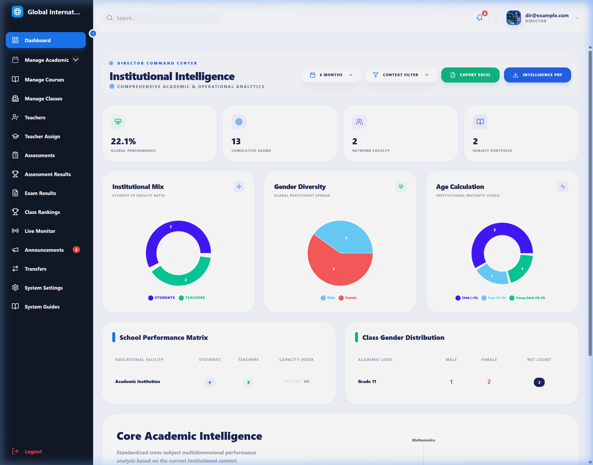
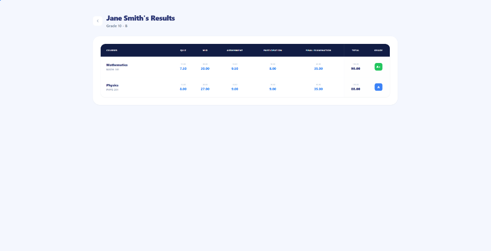
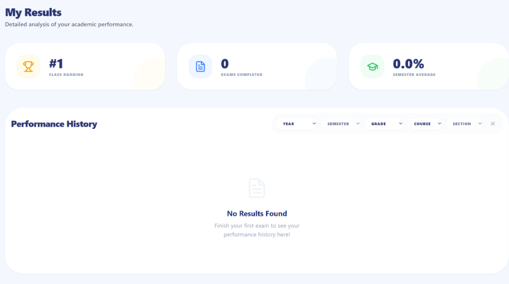
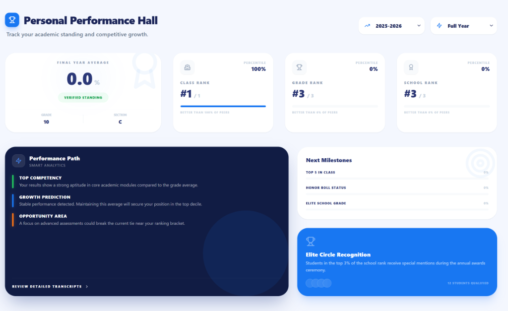

<div align="center">
  

  <h1 align="center">Academic & Exam Management System</h1>
  <p align="center">
    <strong>A  Academic & Exam Management System</strong>
    <br />
    <br />
    <a href="#-about-the-project">About</a>
    ·
    <a href="#-key-features">Features</a>
    ·
    <a href="#%EF%B8%8F-technology-stack">Tech Stack</a>
    ·
    <a href="#-installation--setup">Installation</a>
  </p>
</div>

<div align="center">
  
  [](https://reactjs.org/)
  [](https://www.typescriptlang.org/)
  [-339933?style=for-the-badge&logo=node.js)](https://nodejs.org/)
  [](https://www.microsoft.com/sql-server)
  [](https://tailwindcss.com/)

</div>

---

## � About The Project

**NexExam** is a comprehensive, full-stack educational platform designed to bridge the gap between heavy administrative data management and high-stakes pedagogical real-time events. 

Built entirely with **TypeScript** for robust end-to-end type safety, this platform scales effortlessly from managing simple course resources to executing secure, live-proctored online examinations for thousands of students. It natively handles complex school architectures, supporting nested layers of Academic Years, Semesters, Grades, Sections, and distinct user roles with strict RBAC (Role-Based Access Control).

### 🔥 Unique Selling Propositions
* **Tab-Switch Proctoring Engine:** Tracks `visibilitychange` events natively. If a student attempts to open an AI tool or search for an answer during a live exam, the system temporarily locks their screen and flags the teacher.
* **Weighted Academic Processing:** Automates complex point scaling, semester rank calculations, and GPA generation entirely via complex SQL Server aggregation pipelines.
* **Premium Glassmorphic UI:** Features vibrant, animated, and responsive user interfaces crafted carefully with Tailwind CSS and Framer Motion.

---

## ✨ Key Features

### 🛠️ Administrator (System Architecture)
- **Role-Based Access Control (RBAC):** Manage the entire user lifecycle, defining granular permissions for Teachers, Students, and Directors to ensure data integrity and security.
- **System Personalization & Branding:** Configure institution-wide settings including school logo, contact information, and primary colors to tailor the platform's visual identity.
- **Infrastructure Health & Database Management:** Perform critical maintenance tasks such as direct MS SQL Server backups (Full, Differential, or Log) and database restores directly from the web interface.
- **Global Announcements:** Orchestrate system-wide communications to all users through a dedicated notification engine.

### 🏛️ Director (Academic Operations)
- **Academic Lifecycle Logistics:** Effortlessly manage mass enrollments, student class transfers, and automated end-of-year promotions across different academic years and semesters.
- **Executive Live Monitor:** Gain real-time observability into all active exam sessions across the institution, monitoring server load and proctoring interventions as they happen.
- **Institutional Analytics & Insights:** Instantly generate high-level performance percentiles, class rankings, and statistical trends with exportable PDF/Excel reporting suites.
- **Curriculum & Staff Oversight:** Monitor course modules, manage teacher-class assignments, and review institutional assessment results to maintain high academic standards.

### 👩‍🏫 Teacher (Instruction & Assessment)
- **Intelligent Exam Builder:** Construct dynamic quizzes, mid-terms, and finals featuring multiple choice, true/false, matching, and essay question types. Configure tight time limits and scheduling.
- **Proctoring Command Center:** Watch students as they take your test in real-time. Uncover suspicious behavior and unlock temporarily locked attempts remotely.
- **Guided Grading Engine:** Automatically assess objective questions while utilizing a dedicated manual-grading interface to evaluate essays and leave constructive, personalized feedback.
- **Resource Repository:** Build course modules and upload learning materials, assignments, and guidelines for targeted student sections.

### 👩‍🎓 Student (Exam Experience & Records)
- **Action-Oriented Dashboard:** Immediately see active ongoing exams, upcoming assignments, recently published grades, and personal academic rankings.
- **Distraction-Free Test Environment:** Secure taking interface featuring auto-saving intervals, dynamic countdown timers, and strict anti-cheat event listeners.
- **Offline Transcripts & Reviews:** Access deeply detailed question-by-question post-exam reviews, and generate fully formatted PDF transcripts of your entire semester's performance.

---

## 🛠️ Technology Stack & Languages

NexExam is built using modern, industry-standard web technologies to ensure speed, security, and maintainability.

### Frontend
- **Language:** TypeScript (`.tsx`)
- **Framework:** React 18 (Bootstrapped with Vite for extreme HMR speed)
- **State & Routing:** Hooks, Context API, React Router DOM v6
- **Styling:** Tailwind CSS v3 (Utility-first), Framer Motion (Delightful UI animations)
- **Icons & Tooling:** Lucide React, Zod (Schema validation), React Hook Form 
- **Document Generation:** html2canvas, jsPDF, XLSX

### Backend
- **Language:** Node.js powered by TypeScript for strict typing of API payloads.
- **Framework:** Express.js (v5)
- **Authentication:** JSON Web Tokens (JWT) working alongside Bcrypt for secure, stateless password encryption.
- **File System:** Multer (For assignment uploads, profile pictures, and PDF generations).
- **Task Scheduling:** `node-cron` for executing automated maintenance jobs.

### Database
- **Engine:** Microsoft SQL Server (MSSQL)
- **Driver:** `mssql` node library.
- **Why MSSQL?:** Chosen specifically for its supreme transaction integrity, stored procedure capabilities, and advanced relational aggregate functions required to calculate weighted student grades in milliseconds.

---

## 🚥 Installation & Setup

Want to run NexExam locally? Follow these steps:

### Prerequisites
- [Node.js](https://nodejs.org/) (v18.0.0 or higher)
- [Microsoft SQL Server](https://www.microsoft.com/en-us/sql-server/sql-server-downloads) (Express edition is perfectly fine)
- [Git](https://git-scm.com/)

### 1. Database Configuration
Ensure MS SQL Server is running and accessible. Create a blank database:
```sql
CREATE DATABASE OnlineExamDB;
```
*(The backend is built with initialization scripts that will automatically seed your tables upon the first connection.)*

### 2. Clone the Repository
```bash
git clone https://github.com/your-username/Online-Examination-and-Academic-Management-System.git
cd Online-Examination-and-Academic-Management-System
```

### 3. Backend Setup
```bash
cd backend

# Install all NodeJS dependencies
npm install

# Create environment configuration
touch .env
```
Populate your `/backend/.env` file:
```env
PORT=5000
DB_USER=your_sql_username
DB_PASSWORD=your_sql_password
DB_SERVER=localhost
DB_NAME=OnlineExamDB
JWT_SECRET=super_secret_cryptographic_key
```
Start the local server:
```bash
npm run dev
```

### 4. Frontend Setup
Open a completely separate terminal window and navigate to the frontend directory:
```bash
cd frontend

# Install all NodeJS dependencies
npm install

# Start the Vite development server
npm run dev
```

The application client should now be locally hosted at `http://localhost:5173`. 
*(Note: Be sure your database is running before attempting to login!)*

---

## 📸 Platform Previews

| Director Analytics Dashboard | Live Teacher Proctoring |
| :---: | :---: |
|  |  |

| Secure Student Exam Room | PDF Transcript Generation |
| :---: | :---: |
|  |  |

---

## 🤝 Contributing

We welcome contributions! If you have an idea to improve the system or fix a bug:
1. Fork the Project
2. Create your Feature Branch (`git checkout -b feature/AmazingImplementation`)
3. Commit your Changes (`git commit -m 'Add an amazing new feature'`)
4. Push to the Branch (`git push origin feature/AmazingImplementation`)
5. Open a Pull Request

---

## 📜 License

Distributed under the MIT License. See `LICENSE` for more information.

---
*Developed with ❤️ for educational institutions worldwide.*
